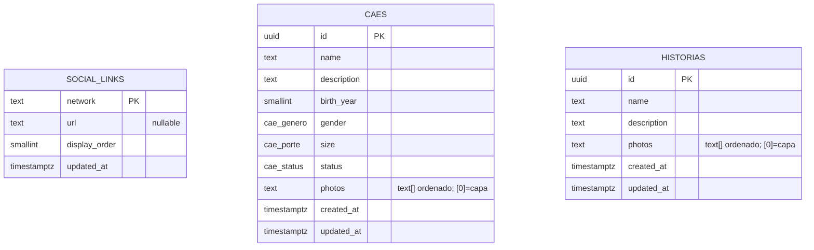

# DATA_MODEL.md

Fonte de verdade do banco. Materializado em `supabase/migrations/`; schema base validado no stack local. A migration de Histórias aguarda `supabase db reset` com o Docker ativo. Ainda sem projeto hospedado.

## DER

## `social_links`

Links das redes sociais exibidas no site. O frontend identifica o ícone por `network` e usa a URL retornada pelo banco, sem destinos cravados no código.

| Coluna | Tipo | Regra |
|---|---|---|
| `network` | `text` | PK; identificador estável, inicialmente `facebook` e `instagram` |
| `url` | `text` | nullable enquanto não configurada; deve ser URL HTTPS válida |
| `display_order` | `smallint` | not null; unique; ordem no footer |
| `updated_at` | `timestamptz` | not null; atualizado automaticamente |

Dados iniciais previstos: `facebook` (ordem 1) e `instagram` (ordem 2), ambos sem URL até o admin configurá-los.

### Exposição e acesso

- RLS habilitada na tabela; `anon` não acessa a tabela diretamente.
- View `social_links_public`: expõe `network`, `url` e `display_order`, somente quando `url` não for nula, ordenada por `display_order`.
- Admin autenticado pode consultar e atualizar as linhas; a condição da policy será definida junto ao modelo de Auth/MFA.
- Inserção e exclusão não fazem parte deste escopo inicial.

## `caes`

Cães cadastrados pelo admin. Fonte única do catálogo de Adoção e do preview de adoção na landing — ambos leem a view pública, nunca a tabela. A idade não é armazenada: o frontend a deriva de `birth_year` (ex.: `"7 ANOS"`), evitando reedição anual.

### Enums

- `cae_genero`: `macho | femea`.
- `cae_porte`: `pequeno | medio | grande`.
- `cae_status`: `disponivel | adotado | falecido`. Apenas `disponivel` aparece ao público; `adotado`/`falecido` somem do catálogo.

| Coluna | Tipo | Regra |
|---|---|---|
| `id` | `uuid` | PK; default `gen_random_uuid()` |
| `name` | `text` | not null |
| `description` | `text` | not null; card trunca (line-clamp), diálogo mostra completo |
| `birth_year` | `smallint` | not null; CHECK `birth_year between 1990 and 2100` (CHECK exige expressão imutável; "não-futuro" é validado no cadastro admin) |
| `gender` | `cae_genero` | not null |
| `size` | `cae_porte` | not null |
| `status` | `cae_status` | not null; default `disponivel` |
| `photos` | `text[]` | not null; default `'{}'`; caminhos ordenados no Storage, `[0]` = capa (regra "≥1 foto para publicar" fica na fase admin) |
| `created_at` | `timestamptz` | not null; default `now()` |
| `updated_at` | `timestamptz` | not null; atualizado automaticamente |

### Exposição e acesso

- RLS habilitada na tabela; `anon` não acessa a tabela diretamente.
- View `caes_public`: expõe `id`, `name`, `description`, `birth_year`, `gender`, `size`, `photos`, somente quando `status = 'disponivel'`, ordenada por `created_at` desc. Não expõe `status` (público só vê disponíveis). O preview da landing usa os primeiros N desta mesma view.
- Admin autenticado pode inserir, consultar, atualizar e excluir; a condição da policy será definida junto ao modelo de Auth/MFA — **ainda não há policies admin nas migrations** (por ora só o service role escreve).
- Upload e compressão das fotos no Storage fazem parte da fase admin, não deste escopo.

## `historias`

Histórias de adoção exibidas na página dedicada e no preview da landing. São independentes de `caes`: não exigem porte, idade, gênero ou status. O card trunca `description`; o diálogo mostra o texto completo.

| Coluna | Tipo | Regra |
|---|---|---|
| `id` | `uuid` | PK; default `gen_random_uuid()` |
| `name` | `text` | not null |
| `description` | `text` | not null |
| `photos` | `text[]` | not null; default `'{}'`; caminhos ordenados no Storage, `[0]` = capa |
| `created_at` | `timestamptz` | not null; default `now()` |
| `updated_at` | `timestamptz` | not null; atualizado automaticamente |

### Exposição e acesso

- RLS habilitada na tabela; `anon` não acessa a tabela diretamente.
- View `historias_public`: expõe `id`, `name`, `description` e `photos`, ordenada por `created_at` desc. A página de Histórias e o preview da landing usam essa mesma view.
- Admin autenticado poderá inserir, consultar, atualizar e excluir; as policies serão definidas com Auth/MFA.
- Upload, compressão e regra de ao menos uma foto fazem parte da fase admin.
