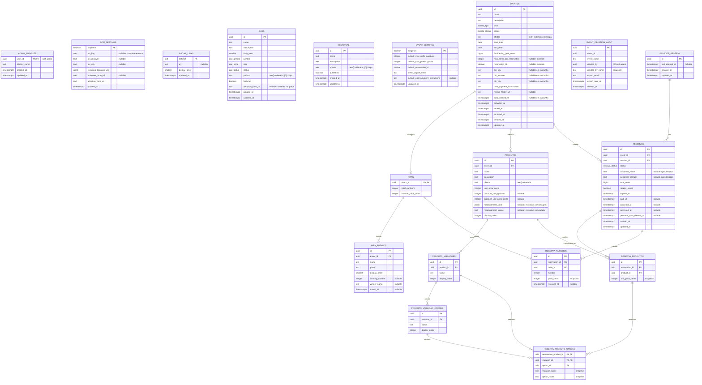

# DATA_MODEL.md

Fonte de verdade do banco. O schema está materializado em `supabase/migrations/` e validado localmente; a produção hospedada `banco_site_abrigo` está validada até `20260805130000`, com `20260809120000`–`20260809150000` pendentes de publicação. O projeto legado `site-do-abrigo` permanece fora de uso.

## Imagens no Storage

- Todo arquivo passa por `compressImage` de `packages/shared` no client antes do upload; somente JPG, PNG e WebP com até 500.000 bytes seguem ao Storage.
- `compressImage` reencoda em WebP mesmo o arquivo já dentro do limite: o canvas descarta EXIF/GPS/XMP por construção e o bucket é público, então devolver o original vazaria a localização de quem fotografou.
- Cães, Histórias, Eventos, Produtos, prêmios e guias de medidas usam o bucket público `dog-photos` (limite 500.000 bytes; JPG, PNG e WebP), sempre via `compressImage`; os CRUDs removem objetos descartados.
- O limite do bucket é declarado em bytes nos dois lugares: `500000` na migration (vale no hospedado) e `"500000B"` em `config.toml` (vale no local). `"500KB"` seria lido como 500 KiB e faria o local divergir em 12.000 bytes.
- Local: `supabase/seed-storage/` guarda as imagens fictícias referenciadas pelo `seed.sql`; `supabase/config.toml` (`[storage.buckets.dog-photos]`) reenvia essa pasta ao bucket a cada `supabase db reset`.

## DER

## Rastreabilidade administrativa

`admin_profiles` mantém a identidade privada exibida na auditoria: `user_id uuid` é PK/FK para `auth.users` com cascade, `display_name text` exige 2–60 caracteres sem espaços nas pontas e os timestamps são automáticos. Admin com `aal2` lê os perfis; cada admin insere ou altera somente o próprio. Não há exposição pública.

Os agregados `caes`, `historias`, `eventos`, `reservas`, `site_settings`, `event_settings` e `social_links` compartilham `updated_at`, `updated_by uuid` (FK nullable para `auth.users`, `ON DELETE SET NULL`) e `updated_by_name text` (snapshot obrigatório). Trigger de banco sobrescreve qualquer autoria enviada pelo client: admin recebe seu perfil, escrita pública recebe “Visitante” e cron/RPC interna recebe “Sistema”. Registros anteriores à migration começam como “Sistema”; renomear ou excluir o perfil não altera snapshots. Sorteio atualiza o evento, ativação/exclusão recebe o admin validado pela Edge Function e expiração automática permanece atribuída ao sistema. As views públicas omitem os três metadados de autoria.

## `site_settings`

Configuração singleton compartilhada pelos CTAs públicos e pela gestão de Cães.

| Coluna | Tipo | Regra |
|---|---|---|
| `singleton` | `boolean` | PK; sempre `true` |
| `pix_key` | `text` | nullable; 1–77 caracteres; chave Pix compartilhada por doação e por padrão dos eventos |
| `pix_receiver` | `text` | nullable; 1–25 caracteres; nome no Pix |
| `pix_city` | `text` | nullable; 1–15 caracteres; cidade no Pix |
| `recurring_donation_urls` | `jsonb` | mapa HTTPS opcional para os valores `10`, `20`, `30`, `50`, `100` e `150` |
| `volunteer_form_url` | `text` | nullable; URL HTTPS; CTA de voluntariado é ocultado quando null |
| `adoption_form_url` | `text` | not null; URL HTTPS; padrão dos CTAs de adoção sem override por cão |
| `updated_at` | `timestamptz` | not null; atualizado automaticamente |

`site_settings_public` expõe os campos usados pelos CTAs públicos. O link de adoção é o padrão global: cada cão pode sobrescrevê-lo por `caes.adoption_form_url`, que é anulável e nunca substitui a fonte global. Os três campos Pix precisam estar preenchidos para habilitar a doação única (a mesma chave alimenta os novos eventos); cada valor recorrente só é habilitado quando possui seu próprio link. O código Pix copia-e-cola nunca é persistido: é gerado no client pela especificação BR Code (EMV MPM), já com o valor de cada doação ou reserva.

## `social_links`

Links das redes sociais exibidas no site. O frontend identifica o ícone por `network` e usa a URL retornada pelo banco, sem destinos cravados no código.

| Coluna | Tipo | Regra |
|---|---|---|
| `network` | `text` | PK; identificador estável, inicialmente `facebook` e `instagram` |
| `url` | `text` | nullable enquanto não configurada; deve ser URL HTTPS válida |
| `display_order` | `smallint` | not null; unique; ordem no footer |
| `updated_at` | `timestamptz` | not null; atualizado automaticamente |

Dados iniciais: `facebook` (ordem 1) e `instagram` (ordem 2), ambos sem URL até o admin configurá-los.

### Exposição e acesso

- RLS habilitada na tabela; `anon` não acessa a tabela diretamente.
- View `social_links_public`: expõe `network`, `url` e `display_order`, somente quando `url` não for nula, ordenada por `display_order`.
- Admin com `app_metadata.role = admin` e sessão `aal2` pode consultar e atualizar as linhas.
- Inserção e exclusão não fazem parte deste escopo inicial.

## `caes`

Cães cadastrados pelo admin. Fonte única do catálogo de Adoção e do preview de adoção na landing — ambos leem a view pública, nunca a tabela. A idade não é armazenada: o frontend a deriva de `birth_year` (ex.: `"7 ANOS"`), evitando reedição anual.

### Enums

- `cae_genero`: `macho | femea`.
- `cae_porte`: `pequeno | medio | grande`.
- `cae_status`: `disponivel | adotado | falecido`. Apenas `disponivel` aparece ao público; `adotado`/`falecido` somem do catálogo.

| Coluna | Tipo | Regra |
|---|---|---|
| `id` | `uuid` | PK; default `gen_random_uuid()` |
| `name` | `text` | not null; texto sem espaços deve ter 1–40 caracteres |
| `description` | `text` | not null; texto sem espaços deve ter 1–1000 caracteres; card trunca (line-clamp), diálogo mostra completo |
| `birth_year` | `smallint` | not null; CHECK `birth_year between 1990 and 2100` (CHECK exige expressão imutável; "não-futuro" é validado no cadastro admin) |
| `gender` | `cae_genero` | not null |
| `size` | `cae_porte` | not null |
| `status` | `cae_status` | not null; default `disponivel` |
| `photos` | `text[]` | not null; default `'{}'`; 0–5 caminhos ordenados no Storage, `[0]` = capa quando existir |
| `featured` | `boolean` | not null; default `false`; destacados aparecem primeiro na view pública; alternado direto no card da listagem admin |
| `adoption_form_url` | `text` | nullable; CHECK HTTPS quando preenchido; override opcional — vazio faz o CTA usar `site_settings.adoption_form_url` |
| `created_at` | `timestamptz` | not null; default `now()` |
| `updated_at` | `timestamptz` | not null; atualizado automaticamente |

### Exposição e acesso

- RLS habilitada na tabela; as migrations não concedem acesso direto a `anon`.
- View `caes_public`: expõe `id`, `name`, `description`, `birth_year`, `gender`, `size`, `photos`, `featured` e `adoption_form_url`, somente quando `status = 'disponivel'`, ordenada por `featured` desc e `created_at` desc. Não expõe `status`.
- CRUD e Storage exigem admin autenticado com `aal2`; `anon` não possui acesso direto.

## `historias`

Histórias de adoção exibidas na página dedicada e no preview da landing. São independentes de `caes`: não exigem porte, idade, gênero ou o status do catálogo de cães. O card trunca `description`; o diálogo mostra o texto completo.

| Coluna | Tipo | Regra |
|---|---|---|
| `id` | `uuid` | PK; default `gen_random_uuid()` |
| `name` | `text` | not null; texto sem espaços deve ter 1–40 caracteres |
| `description` | `text` | not null; texto sem espaços deve ter 1–1000 caracteres |
| `photos` | `text[]` | not null; default `'{}'`; CHECK exige 1–5 caminhos ordenados no Storage, `[0]` = capa |
| `published` | `boolean` | not null; default `false`; somente publicadas aparecem na view pública |
| `created_at` | `timestamptz` | not null; default `now()` |
| `updated_at` | `timestamptz` | not null; atualizado automaticamente |

### Exposição e acesso

- RLS habilitada na tabela; `anon` não acessa a tabela diretamente.
- View `historias_public`: expõe `id`, `name`, `description` e `photos` apenas quando `published = true`, ordenada por `created_at` desc. A página de Histórias e o preview da landing usam exclusivamente essa view.
- Inserção, consulta, atualização e exclusão exigem admin autenticado com `aal2`.

## Eventos e reservas

Cada evento é exclusivamente `rifa` ou `produtos`. Pode existir no máximo um evento `ativo`; os encerrados formam o histórico público. Reservas nunca misturam tipos nem eventos.

### Enums

- `evento_tipo`: `rifa | produtos`.
- `evento_status`: `rascunho | ativo | encerrado | arquivado`.
- `reserva_status`: `pendente | paga | cancelada | entregue`.

### `event_settings`

Configuração singleton editável pelo admin. Os limites são por reserva, não por pessoa: uma mesma sessão pode criar outras reservas depois do intervalo antissobrecarga. Os dados do Pix (chave, recebedor e cidade) usados como padrão de novos eventos vivem em `site_settings`, não aqui.

| Coluna | Tipo | Regra |
|---|---|---|
| `singleton` | `boolean` | PK; sempre `true`, garantindo uma única linha |
| `default_max_raffle_numbers` | `integer` | not null; `> 0`; máximo padrão de números por reserva de rifa |
| `default_max_product_units` | `integer` | not null; `> 0`; máximo padrão de unidades, somando todos os produtos da reserva |
| `default_reservation_ttl` | `interval` | not null; mínimo de 1 minuto e somente minutos inteiros; prazo padrão de expiração |
| `event_export_email` | `text` | nullable até ser configurado; obrigatório antes de publicar o quinto evento ou excluir arquivado legado |
| `default_post_payment_instructions` | `text` | nullable; instrução preenchida em novos eventos |
| `updated_at` | `timestamptz` | not null; atualizado automaticamente |

### `eventos`

| Coluna | Tipo | Regra |
|---|---|---|
| `id` | `uuid` | PK; default `gen_random_uuid()` |
| `name` | `text` | nullable somente enquanto rascunho; obrigatório para ativar |
| `description` | `text` | nullable somente enquanto rascunho; obrigatório para ativar |
| `type` | `evento_tipo` | not null; imutável depois da primeira reserva |
| `status` | `evento_status` | not null; default `rascunho` |
| `photos` | `text[]` | not null; default `'{}'`; `[0]` = capa |
| `start_date` | `date` | nullable somente enquanto rascunho; início inclusivo; deve ser `<= end_date` |
| `end_date` | `date` | nullable somente enquanto rascunho; fim inclusivo; o cron encerra evento ativo após esta data |
| `fundraising_goal_cents` | `bigint` | nullable somente enquanto rascunho; `> 0`; meta em centavos |
| `max_items_per_reservation` | `integer` | nullable; `> 0`; substitui o padrão correspondente ao tipo do evento |
| `reservation_ttl` | `interval` | nullable; mínimo de 1 minuto e somente minutos inteiros; substitui `default_reservation_ttl` |
| `pix_key` / `pix_receiver` / `pix_city` | `text` | nullable em rascunho; os três obrigatórios para ativar; preenchidos pelo padrão de `site_settings` com override por evento; o código copia-e-cola é gerado no client, nunca persistido |
| `post_payment_instructions` | `text` | nullable somente enquanto rascunho; orienta o envio do comprovante e é obrigatório para ativar |
| `receipt_folder_url` | `text` | nullable; atalho HTTPS externo dos comprovantes |
| `draft_payload` | `jsonb` | nullable; estado integral do formulário parcial, incluindo caminhos de imagens; deve ser removido pela gravação completa antes de ativar |
| `data_verified_at` | `timestamptz` | nullable em rascunho; obrigatório para ativar; preenchido após a confirmação administrativa |
| `activated_at` | `timestamptz` | nullable; preenchido ao ativar |
| `ended_at` | `timestamptz` | nullable; preenchido ao encerrar |
| `archived_at` | `timestamptz` | nullable; preservado apenas para registros legados, que não aparecem nas views públicas |
| `created_at` | `timestamptz` | not null; default `now()` |
| `updated_at` | `timestamptz` | not null; atualizado automaticamente |

Índice unique parcial em `status = 'ativo'` garante um único evento ativo. Trigger adicional impede arquivamento novo, ativação direta e mais de quatro eventos com status diferente de `rascunho`. A ativação rejeita `draft_payload`, exige todos os dados gerais/Pix, foto e configuração específica do tipo. Valores monetários permanecem padronizados em centavos e o TTL em minutos inteiros convertidos para `interval`.

Rascunhos não entram no teto e podem ser excluídos diretamente. Eventos ativados permanecem como `ativo|encerrado`: ao publicar um novo rascunho quando já existem quatro, a Edge Function autenticada `activate-event` usa `service_role` somente para montar a exportação completa do menor `activated_at`, envia JSON estruturado + CSV das reservas ao `event_settings.event_export_email` via Resend e chama `activate_event`. Sob lock transacional, a RPC confirma destinatário/evento/horário, audita, apaga o domínio antigo por cascade e ativa o novo. Falha no envio preserva os quatro eventos e o rascunho. Fotos não são anexadas; seus caminhos constam no JSON e os objetos são removidos do Storage após a transação. `delete-archived-event` permanece somente para remoção de arquivados legados.

### `event_deletion_audit`

Auditoria mínima preservada após a exclusão, sem os dados operacionais do evento. `event_id` não possui FK para permitir a remoção da linha original.

| Coluna | Tipo | Regra |
|---|---|---|
| `id` | `uuid` | PK; default `gen_random_uuid()` |
| `event_id` | `uuid` | not null; identificador do evento removido, sem FK |
| `event_name` | `text` | not null; snapshot para identificação administrativa |
| `deleted_by` | `uuid` | FK nullable → `auth.users.id`; novas exclusões registram o admin e sua remoção aplica `ON DELETE SET NULL` |
| `deleted_by_name` | `text` | not null; snapshot do nome/apelido no momento da exclusão |
| `export_email` | `text` | not null; snapshot do destinatário configurado |
| `export_sent_at` | `timestamptz` | not null; instante em que o envio da cópia foi confirmado |
| `deleted_at` | `timestamptz` | not null; default `now()` |

Exclusões automáticas usam `activate_event`, recebendo da Edge Function o usuário previamente validado; arquivados legados usam `delete_archived_event` e registram `auth.uid()`. Ambas exigem e-mail configurado e horário de envio confirmado e apagam evento, reservas e itens na mesma transação.

### `rifas`

Relação 1:1 obrigatória apenas quando `eventos.type = 'rifa'`. Os números possíveis são sempre inteiros de `1` a `total_numbers`.

| Coluna | Tipo | Regra |
|---|---|---|
| `event_id` | `uuid` | PK e FK → `eventos.id` |
| `total_numbers` | `integer` | not null; `> 0`; quantidade definida pelo admin |
| `number_price_cents` | `integer` | not null; `> 0`; preço igual para todos os números |

### `rifa_premios`

Prêmios ordenados de uma rifa. Uma rifa precisa ter ao menos um prêmio antes de ser publicada; cada prêmio recebe seu próprio resultado.

| Coluna | Tipo | Regra |
|---|---|---|
| `id` | `uuid` | PK; default `gen_random_uuid()` |
| `event_id` | `uuid` | not null; FK → `rifas.event_id` |
| `name` | `text` | not null; texto sem espaços |
| `photo` | `text` | not null; caminho da imagem comprimida no Storage |
| `display_order` | `smallint` | not null; `>= 1`; unique dentro da rifa |
| `winning_number` | `integer` | nullable; entre `1` e `rifas.total_numbers`; deve pertencer a uma reserva paga da rifa |
| `winner_name` | `text` | nullable; snapshot exibido somente no admin; preenchido junto com `winning_number` |
| `drawn_at` | `timestamptz` | nullable; preenchido junto com o resultado |

`rifa_premios_public` expõe o resultado somente por `winning_number` e `drawn_at`; `winner_name` permanece restrito à tabela administrativa.

### `produtos`

Produtos são feitos sob demanda, sem estoque. Um evento de produtos pode possuir vários produtos, embora o caso padrão seja apenas um.

| Coluna | Tipo | Regra |
|---|---|---|
| `id` | `uuid` | PK; default `gen_random_uuid()` |
| `event_id` | `uuid` | not null; FK → `eventos.id`; evento deve ser do tipo `produtos` |
| `name` | `text` | not null; unique dentro do evento |
| `description` | `text` | not null |
| `photos` | `text[]` | not null; default `'{}'`; caminhos ordenados |
| `unit_price_cents` | `integer` | not null; `> 0` |
| `discount_min_quantity` | `integer` | nullable; `>= 2` e `<=` limite efetivo de unidades por reserva; preenchido junto com `discount_unit_price_cents` |
| `discount_unit_price_cents` | `integer` | nullable; `> 0` e `< unit_price_cents`; preço unitário quando o limiar é atingido |
| `measurement_table` | `jsonb` | nullable; `variationId`, valores da variação e seções/linhas da tabela inserida pelo admin |
| `measurement_image` | `text` | nullable; caminho da imagem de medidas no Storage |
| `display_order` | `integer` | not null; unique dentro do evento |

O desconto é calculado separadamente por produto. Se uma reserva alcançar `discount_min_quantity` unidades do mesmo produto, todas as unidades daquele produto usam `discount_unit_price_cents`; quantidades de produtos diferentes não são somadas para atingir o desconto. Triggers impedem salvar um desconto acima do limite efetivo e também impedem reduzir o limite do evento ou o padrão até tornar um desconto existente inalcançável.

O guia de medidas é opcional, mas aceita apenas um formato por produto: `measurement_table` ou `measurement_image`. `is_valid_measurement_table` exige tamanhos, seções, linhas e a mesma quantidade de valores por tamanho. Na tabela manual, `variationId` identifica a variação que fornece as colunas; o admin oferece escolha exclusiva e limpa o formato anterior.

### `produto_variacoes` e `produto_variacao_opcoes`

Cada produto possui zero ou mais variações configuráveis, como `Tamanho` e `Caimento`. Cada variação possui uma ou mais opções ordenadas. Todas as combinações do produto cartesiano das opções são válidas; não há tabela de combinações nem estoque por combinação.

| Tabela | Colunas e regras |
|---|---|
| `produto_variacoes` | `id uuid` PK; `product_id uuid` FK; `name text`; `display_order integer`; nome e ordem unique dentro do produto |
| `produto_variacao_opcoes` | `id uuid` PK; `variation_id uuid` FK; `name text`; `display_order integer`; nome e ordem unique dentro da variação |

Para adicionar uma unidade à reserva, o usuário deve escolher exatamente uma opção de cada variação daquele produto. Produto sem variações pode ser reservado sem opções.

### `sessoes_reserva`

Sessão pública anônima e opaca, emitida pelo banco e mantida no `sessionStorage` do navegador. Não contém dados pessoais.

| Coluna | Tipo | Regra |
|---|---|---|
| `id` | `uuid` | PK; gerado pelo banco |
| `last_attempt_at` | `timestamptz` | nullable; base do intervalo antissobrecarga |
| `created_at` | `timestamptz` | not null; default `now()` |
| `updated_at` | `timestamptz` | not null; atualizado automaticamente |

O intervalo mínimo entre tentativas é uma constante do sistema, não uma configuração do admin. A função de reserva bloqueia a linha da sessão, registra a tentativa e recusa outra chamada da mesma sessão dentro do intervalo. Essa proteção limita abuso acidental por sessão; a defesa contra troca deliberada de sessão é o teto por IP descrito a seguir.

### `reserva_ip_sal` e `reserva_ip_tentativas`

Teto por IP de origem, aplicado por trigger `before insert` em `sessoes_reserva` e em `reservas` — protege qualquer origem, não apenas as RPCs públicas.

| Tabela | Colunas e regras |
|---|---|
| `reserva_ip_sal` | `singleton boolean` PK; `sal bytea` gerado uma vez por instalação com `gen_random_bytes(32)` |
| `reserva_ip_tentativas` | `id bigint` PK; `ip_hash bytea`; `kind reserva_tentativa_tipo` (`sessao`/`reserva`); `created_at timestamptz`; índice em (`ip_hash`, `kind`, `created_at desc`) |

Limites por IP na janela de 1 hora, constantes do sistema: 60 criações de sessão e 20 reservas. Cada aba abre sua própria sessão e operadoras compartilham IP por NAT, então os tetos são altos o bastante para não barrar visitante legítimo.

`current_request_ip_hash()` lê `cf-connecting-ip` (preenchido pela borda do Supabase, não falsificável pelo client) e cai para o primeiro salto de `x-forwarded-for`. O IP nunca é armazenado em claro: só o SHA-256 de IP + sal, para que nenhuma cópia do banco revele visitantes. Chamada sem cabeçalho de origem — seed, `psql`, `pg_cron` — não é atribuída a ninguém e não conta.

As duas tabelas têm RLS habilitada e **nenhuma** policy: apenas as funções `security definer` as enxergam; nem o admin lê o histórico de IPs, que não tem uso administrativo. `expire_event_reservations` descarta tentativas com mais de 24 horas.

Limitação conhecida: a tentativa é registrada na mesma transação da reserva, então uma chamada que falha e aborta não é contabilizada. O teto cobre reservas efetivadas — que é o abuso relevante — e não substitui proteção contra flood de chamadas inválidas, que exigiria bloqueio antes do banco.

### `reservas`

Cabeçalho comum a reservas de rifa e de produtos.

| Coluna | Tipo | Regra |
|---|---|---|
| `id` | `uuid` | PK; default `gen_random_uuid()` |
| `reference_code` | `text` | not null; 12 caracteres hexadecimais maiúsculos; default aleatório; unique; visível somente ao admin |
| `event_id` | `uuid` | not null; FK → `eventos.id`; somente evento `ativo` |
| `session_id` | `uuid` | not null; FK → `sessoes_reserva.id` |
| `status` | `reserva_status` | not null; default `pendente` |
| `customer_name` | `text` | not null na criação; mínimo de duas partes separadas por espaço; torna-se null na limpeza pós-evento |
| `customer_contact` | `text` | not null na criação; telefone brasileiro válido em `+55...` ou e-mail completo; torna-se null na limpeza pós-evento |
| `total_cents` | `bigint` | not null; `> 0`; calculado no banco |
| `receipt_saved` | `boolean` | not null; default `false`; controle administrativo de que o comprovante foi salvo no destino externo |
| `expires_at` | `timestamptz` | not null; criação + prazo efetivo do evento |
| `paid_at` | `timestamptz` | nullable; preenchido quando o admin confirma pagamento |
| `canceled_at` | `timestamptz` | nullable; preenchido no cancelamento automático por falta de pagamento ou no cancelamento administrativo |
| `delivered_at` | `timestamptz` | nullable; preenchido quando o admin confirma a entrega do prêmio ao ganhador |
| `personal_data_deleted_at` | `timestamptz` | nullable; registra a limpeza dos dados pessoais após o evento |
| `created_at` | `timestamptz` | not null; default `now()` |
| `updated_at` | `timestamptz` | not null; atualizado automaticamente |

`reference_code` é o identificador operacional curto e persistente usado pelo admin para localizar uma reserva sem depender do nome do visitante. Ele entra nas buscas e exportações administrativas, mas não nas views nem nas respostas públicas. O trigger `reservas_validate_name` exige ao menos duas partes no nome em inserções e alterações de qualquer origem; a limpeza pós-evento pode torná-lo nulo. O trigger `reservas_validate_contact` protege o contato. Telefones exigem DDD oficial e formato brasileiro de fixo/celular, rejeitam assinantes com dígitos repetidos e são normalizados para `+55...`; e-mails exigem endereço e domínio completos e normalizam o domínio para minúsculas. A validação é de plausibilidade e não comprova titularidade ou existência do contato.

O limite efetivo é o override do evento, se preenchido; caso contrário, `default_max_raffle_numbers` (5) ou `default_max_product_units` (10). `eventos_public.max_items_per_reservation` já expõe esse valor resolvido para orientar a seleção, e as RPCs repetem a resolução ao efetivar a reserva. O prazo padrão é 15 minutos; eventos podem substituí-lo. Reservas pendentes que ultrapassam `expires_at` passam automaticamente para `cancelada` via `pg_cron`; reservas pagas não expiram. Cancelamento libera números da rifa. `entregue` só sucede `paga` após o encerramento: para produto, em qualquer reserva paga; para rifa, apenas na reserva ganhadora. Os valores e rótulos selecionados ficam registrados como snapshots. `receipt_saved` é somente o controle administrativo do destino externo.

Transições de status permitidas pelo trigger `validate_reservation_status`:

- `pendente → paga` (grava `paid_at`);
- `pendente|paga → cancelada` (grava `canceled_at`; bloqueada em reserva sorteada);
- `paga → entregue` (grava `delivered_at`; exige evento encerrado e, na rifa, reserva ganhadora).

Reversões de estados marcados por engano (todas renovam o `expires_at` com um TTL fresco quando voltam a `pendente`, senão o cron cancelaria a reserva no ato):

- `paga → pendente` (limpa `paid_at`; bloqueada se a reserva já foi sorteada);
- `cancelada → pendente` (limpa `canceled_at`; reconquista os números liberados em bloco — se algum já foi retomado por outra reserva, o índice único aborta e a reversão falha);
- `entregue → paga` (limpa `delivered_at`).

Qualquer outra transição é rejeitada. Não há estado terminal: cancelada e entregue podem ser revertidas, mas voltar de `paga → pendente` fica indisponível assim que a reserva é sorteada.

`update_event_reservation` (`security invoker`, somente `authenticated`) edita uma reserva `pendente|paga` em uma única transação. A função valida e normaliza os dados pessoais, substitui números ou unidades/opções, rejeita conflitos e alterações de números já sorteados, recalcula preços/descontos pelo catálogo atual e respeita as transições de status existentes. RLS continua exigindo admin com AAL2.

### `reserva_produtos` e `reserva_produto_opcoes`

Cada linha de `reserva_produtos` representa uma unidade. `product_name` e `unit_price_cents` guardam os snapshots do produto e do preço calculado para aquela reserva.

`reserva_produto_opcoes` possui unique (`reservation_product_id`, `variation_id`) enquanto a variação existe. `product_id`, `variation_id` e `option_id` tornam-se nulos se o catálogo mudar; `product_name`, `variation_name` e `option_name` preservam o histórico. A função valida a cadeia e exige uma opção de cada variação.

### `reserva_numeros`

| Coluna | Tipo | Regra |
|---|---|---|
| `id` | `uuid` | PK; default `gen_random_uuid()` |
| `reservation_id` | `uuid` | not null; FK → `reservas.id` |
| `raffle_id` | `uuid` | not null; FK → `rifas.event_id` |
| `number` | `integer` | not null; entre `1` e `rifas.total_numbers` |
| `price_cents` | `integer` | not null; snapshot de `number_price_cents` |
| `released_at` | `timestamptz` | nullable; preenchido ao cancelar |

Índice unique parcial em (`raffle_id`, `number`) onde `released_at is null` impede duas reservas simultâneas do mesmo número e permite reutilizá-lo após liberação. A criação da reserva e a alocação dos números ocorrem em uma única transação; conflito devolve indisponibilidade sem reserva parcial.

### Exposição, RLS e funções

- Todas as tabelas do domínio têm RLS habilitada; `anon` não lê nem escreve tabelas diretamente.
- Views públicas expõem no máximo quatro eventos `ativo|encerrado` com o limite efetivo por reserva, produtos, variações, opções e disponibilidade dos números, sem dados pessoais ou identificadores de sessão. Rascunhos e arquivados legados não aparecem.
- As onze views `*_public` usam `security definer` de forma intencional, pois `security_invoker` exigiria conceder leitura das tabelas-base ao público e quebraria esse limite arquitetural. Todas usam `security_barrier`; o pgTAP trava quantidade, colunas e privilégios.
- `anon` cria a sessão e a reserva apenas por funções `security definer` com `search_path` fixo. As funções validam status/tipo do evento, intervalo da sessão, limites, opções, disponibilidade, preços, descontos e prazo no servidor.
- Alterações de preço ou configuração não afetam reservas existentes porque totais, preços unitários e seleções são snapshots.
- Admin autenticado com `aal2` gerencia catálogo, confirma pagamento, cancela reserva e marca a entrega ao ganhador.
- `pg_cron` encerra eventos fora do período, cancela reservas pendentes vencidas, libera seus números e limpa sessões antigas. Após 90 dias do encerramento, remove `customer_name` e `customer_contact`, preservando snapshots e totais.
- No caminho de reserva, `reserve_raffle_numbers`/`reserve_product_items` chamam `expire_reservations_for_event(uuid)`, que libera apenas as reservas vencidas do próprio evento antes de checar disponibilidade; a varredura global e a limpeza de sessões/tentativas de IP ficam no cron `expire_event_reservations()`.
- Cada número pago pode ganhar no máximo um prêmio por rifa; o índice e a RPC de sorteio aplicam a regra.

## Auth e matriz de acesso administrativo

- Contas administrativas são convidadas fora do client pelo Dashboard ou Admin API; cadastro público está desabilitado. `assign_invited_admin_role` atribui `app_metadata.role = admin` somente quando `auth.users.invited_at` está preenchido, tanto na inserção quanto na atualização posterior usada pelo Supabase hospedado.
- O convite abre uma sessão `aal1` na tela de cadastro. O frontend sincroniza primeiro o nome/apelido em `user_metadata` e depois define a senha; o trigger cria `admin_profiles` e só então marca `app_metadata.admin_onboarding_completed`. Em seguida, o frontend exige cadastro e verificação do TOTP para elevar a sessão a `aal2` antes de liberar a gestão.
- Admin legado sem perfil informa o nome/apelido uma única vez após chegar a `aal2`; a inserção é feita sob as policies do próprio usuário.
- Em logins posteriores, uma sessão `aal1` com TOTP verificado exige novo desafio. Fatores incompletos são descartados antes de gerar outro QR Code.
- No plano gratuito, o admin encerra no client a sessão após sete dias sem atividade; `auth.sessions.inactivity_timeout` exige plano Pro e permanece desabilitado no serviço hospedado.
- `site_settings`, `social_links`, `caes`, `historias`, `event_settings`, `eventos`, `rifas`, `rifa_premios`, `produtos`, variações/opções e reservas usam uma policy permissiva para `is_admin()` e outra policy restritiva exigindo `aal2`, em leitura e escrita.
- `admin_profiles` permite leitura a admins, mas inserção/alteração somente do próprio perfil; todas as operações também exigem `aal2`.
- `event_deletion_audit` permite somente `select` e `insert` a admin `aal2`; atualizações e exclusões não são concedidas.
- `storage.objects` do bucket `dog-photos` permite `select`, `insert` e `delete` somente a admin `aal2`; leitura pública das imagens continua pelo bucket público.
- `draw_raffle_prize` e `delete_archived_event` são `security invoker`, concedidas apenas a `authenticated`, portanto respeitam RLS e grants. `activate_event` é `security definer` com `search_path` fixo e execução exclusiva de `service_role`: a Edge Function valida admin + `aal2`, registra o usuário e usa essa RPC interna para confirmar envio, excluir e ativar sob advisory lock.
- `anon` lê apenas views públicas e executa as RPCs públicas de criação de sessão/reserva. Não há mais policies locais de CRUD anônimo no `seed.sql`.
