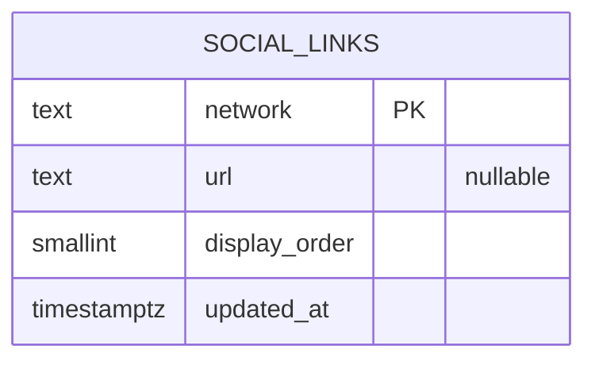

# DATA_MODEL.md

Supabase ainda não configurado. Este arquivo registra o modelo aprovado antes das migrations.

## DER

## `social_links`

Links das redes sociais exibidas no site. O frontend identifica o ícone por `network` e usa a URL retornada pelo banco, sem destinos cravados no código.

| Coluna | Tipo | Regra |
|---|---|---|
| `network` | `text` | PK; identificador estável, inicialmente `facebook` e `instagram` |
| `url` | `text` | nullable enquanto não configurada; deve ser URL HTTPS válida |
| `display_order` | `smallint` | not null; unique; ordem no footer |
| `updated_at` | `timestamptz` | not null; atualizado automaticamente |

Dados iniciais previstos: `facebook` (ordem 1) e `instagram` (ordem 2), ambos sem URL até o admin configurá-los.

### Exposição e acesso

- RLS habilitada na tabela; `anon` não acessa a tabela diretamente.
- View `social_links_public`: expõe `network`, `url` e `display_order`, somente quando `url` não for nula, ordenada por `display_order`.
- Admin autenticado pode consultar e atualizar as linhas; a condição da policy será definida junto ao modelo de Auth/MFA.
- Inserção e exclusão não fazem parte deste escopo inicial.
