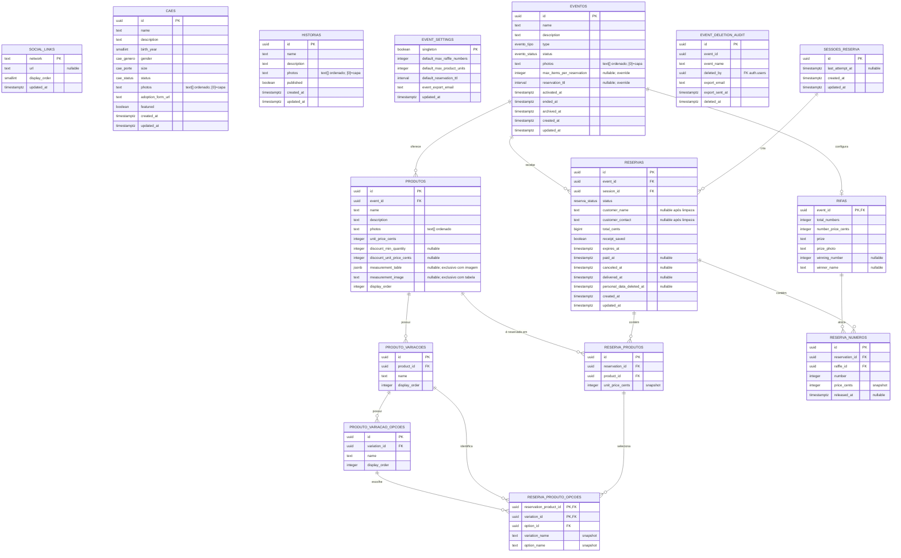

# DATA_MODEL.md

Fonte de verdade do banco. O schema base e Histórias estão materializados e validados em `supabase/migrations/`. O domínio de Eventos abaixo está definido, mas só será materializado após a aprovação completa. Ainda sem projeto hospedado.

## Imagens no Storage

- Todo arquivo passa por `compressImage` de `packages/shared` no client antes do upload; somente JPG, PNG e WebP com até 500.000 bytes seguem ao Storage.
- Cães e Histórias usam o bucket público `dog-photos` (limite 500.000 bytes; JPG, PNG e WebP); cada tabela persiste os caminhos em `photos` e o CRUD remove objetos descartados. Eventos, Produtos, prêmios e guias de medidas devem reutilizar o mesmo utilitário.

## DER

## `social_links`

Links das redes sociais exibidas no site. O frontend identifica o ícone por `network` e usa a URL retornada pelo banco, sem destinos cravados no código.

| Coluna | Tipo | Regra |
|---|---|---|
| `network` | `text` | PK; identificador estável, inicialmente `facebook` e `instagram` |
| `url` | `text` | nullable enquanto não configurada; deve ser URL HTTPS válida |
| `display_order` | `smallint` | not null; unique; ordem no footer |
| `updated_at` | `timestamptz` | not null; atualizado automaticamente |

Dados iniciais previstos: `facebook` (ordem 1) e `instagram` (ordem 2), ambos sem URL até o admin configurá-los.

### Exposição e acesso

- RLS habilitada na tabela; `anon` não acessa a tabela diretamente.
- View `social_links_public`: expõe `network`, `url` e `display_order`, somente quando `url` não for nula, ordenada por `display_order`.
- Admin autenticado pode consultar e atualizar as linhas; a condição da policy será definida junto ao modelo de Auth/MFA.
- Inserção e exclusão não fazem parte deste escopo inicial.

## `caes`

Cães cadastrados pelo admin. Fonte única do catálogo de Adoção e do preview de adoção na landing — ambos leem a view pública, nunca a tabela. A idade não é armazenada: o frontend a deriva de `birth_year` (ex.: `"7 ANOS"`), evitando reedição anual.

### Enums

- `cae_genero`: `macho | femea`.
- `cae_porte`: `pequeno | medio | grande`.
- `cae_status`: `disponivel | adotado | falecido`. Apenas `disponivel` aparece ao público; `adotado`/`falecido` somem do catálogo.

| Coluna | Tipo | Regra |
|---|---|---|
| `id` | `uuid` | PK; default `gen_random_uuid()` |
| `name` | `text` | not null; texto sem espaços deve ter 1–40 caracteres |
| `description` | `text` | not null; texto sem espaços deve ter 1–1000 caracteres; card trunca (line-clamp), diálogo mostra completo |
| `birth_year` | `smallint` | not null; CHECK `birth_year between 1990 and 2100` (CHECK exige expressão imutável; "não-futuro" é validado no cadastro admin) |
| `gender` | `cae_genero` | not null |
| `size` | `cae_porte` | not null |
| `status` | `cae_status` | not null; default `disponivel` |
| `photos` | `text[]` | not null; default `'{}'`; 0–5 caminhos ordenados no Storage, `[0]` = capa quando existir |
| `adoption_form_url` | `text` | not null; URL HTTP(S) usada pelo CTA do cão |
| `featured` | `boolean` | not null; default `false`; destacados aparecem primeiro na view pública |
| `created_at` | `timestamptz` | not null; default `now()` |
| `updated_at` | `timestamptz` | not null; atualizado automaticamente |

### Exposição e acesso

- RLS habilitada na tabela; as migrations não concedem acesso direto a `anon`.
- View `caes_public`: expõe `id`, `name`, `description`, `birth_year`, `gender`, `size`, `photos`, `adoption_form_url` e `featured`, somente quando `status = 'disponivel'`, ordenada por `featured` desc e `created_at` desc. Não expõe `status`.
- Enquanto Auth/MFA não existe, `seed.sql` cria policies de CRUD para `anon` condicionadas ao Origin local (`localhost`, `127.0.0.1` ou `::1`). Essas policies não são aplicadas por `supabase db push`.
- O bucket `dog-photos` é público para leitura; upload/leitura de objetos/exclusão pelo admin anônimo recebem a mesma policy temporária apenas no seed local. Policies definitivas exigirão admin autenticado.

## `historias`

Histórias de adoção exibidas na página dedicada e no preview da landing. São independentes de `caes`: não exigem porte, idade, gênero ou o status do catálogo de cães. O card trunca `description`; o diálogo mostra o texto completo.

| Coluna | Tipo | Regra |
|---|---|---|
| `id` | `uuid` | PK; default `gen_random_uuid()` |
| `name` | `text` | not null; texto sem espaços deve ter 1–40 caracteres |
| `description` | `text` | not null; texto sem espaços deve ter 1–1000 caracteres |
| `photos` | `text[]` | not null; default `'{}'`; CHECK exige 1–5 caminhos ordenados no Storage, `[0]` = capa |
| `published` | `boolean` | not null; default `false`; somente publicadas aparecem na view pública |
| `created_at` | `timestamptz` | not null; default `now()` |
| `updated_at` | `timestamptz` | not null; atualizado automaticamente |

### Exposição e acesso

- RLS habilitada na tabela; `anon` não acessa a tabela diretamente.
- View `historias_public`: expõe `id`, `name`, `description` e `photos` apenas quando `published = true`, ordenada por `created_at` desc. A página de Histórias e o preview da landing usam exclusivamente essa view.
- Admin autenticado poderá inserir, consultar, atualizar e excluir; as policies serão definidas com Auth/MFA.
- Enquanto Auth/MFA não existe, `seed.sql` concede CRUD de histórias e Storage a `anon` somente para Origin local; as policies não são aplicadas por `supabase db push`.

## Eventos e reservas

Cada evento é exclusivamente `rifa` ou `produtos`. Pode existir no máximo um evento `ativo`; os encerrados formam o histórico público. Reservas nunca misturam tipos nem eventos.

### Enums

- `evento_tipo`: `rifa | produtos`.
- `evento_status`: `rascunho | ativo | encerrado | arquivado`.
- `reserva_status`: `pendente | paga | cancelada | entregue`.

### `event_settings`

Configuração singleton editável pelo admin. Os limites são por reserva, não por pessoa: uma mesma sessão pode criar outras reservas depois do intervalo antissobrecarga.

| Coluna | Tipo | Regra |
|---|---|---|
| `singleton` | `boolean` | PK; sempre `true`, garantindo uma única linha |
| `default_max_raffle_numbers` | `integer` | not null; `> 0`; máximo padrão de números por reserva de rifa |
| `default_max_product_units` | `integer` | not null; `> 0`; máximo padrão de unidades, somando todos os produtos da reserva |
| `default_reservation_ttl` | `interval` | not null; `> interval '0'`; prazo padrão de expiração |
| `event_export_email` | `text` | not null; e-mail das Configurações que recebe a cópia antes da exclusão definitiva de evento ocorrido |
| `updated_at` | `timestamptz` | not null; atualizado automaticamente |

### `eventos`

| Coluna | Tipo | Regra |
|---|---|---|
| `id` | `uuid` | PK; default `gen_random_uuid()` |
| `name` | `text` | not null |
| `description` | `text` | not null |
| `type` | `evento_tipo` | not null; imutável depois da primeira reserva |
| `status` | `evento_status` | not null; default `rascunho` |
| `photos` | `text[]` | not null; default `'{}'`; `[0]` = capa |
| `max_items_per_reservation` | `integer` | nullable; `> 0`; substitui o padrão correspondente ao tipo do evento |
| `reservation_ttl` | `interval` | nullable; `> interval '0'`; substitui `default_reservation_ttl` |
| `activated_at` | `timestamptz` | nullable; preenchido ao ativar |
| `ended_at` | `timestamptz` | nullable; preenchido ao encerrar |
| `archived_at` | `timestamptz` | nullable; preenchido ao arquivar; eventos arquivados não aparecem nas views públicas |
| `created_at` | `timestamptz` | not null; default `now()` |
| `updated_at` | `timestamptz` | not null; atualizado automaticamente |

Índice unique parcial em `status = 'ativo'` garante um único evento ativo. A ativação valida foto, configuração específica do tipo e ao menos um produto no evento de produtos.

Eventos encerrados precisam ser arquivados antes da exclusão definitiva. Rascunhos podem ser excluídos diretamente. A exclusão de um evento ocorrido gera a cópia enviada a `event_settings.event_export_email` e o registro de auditoria antes de apagar os dados do domínio.

### `event_deletion_audit`

Auditoria mínima preservada após a exclusão, sem os dados operacionais do evento. `event_id` não possui FK para permitir a remoção da linha original.

| Coluna | Tipo | Regra |
|---|---|---|
| `id` | `uuid` | PK; default `gen_random_uuid()` |
| `event_id` | `uuid` | not null; identificador do evento removido, sem FK |
| `event_name` | `text` | not null; snapshot para identificação administrativa |
| `deleted_by` | `uuid` | not null; FK → `auth.users.id`; preenchido com `auth.uid()` |
| `export_email` | `text` | not null; snapshot do destinatário configurado |
| `export_sent_at` | `timestamptz` | not null; instante em que o envio da cópia foi confirmado |
| `deleted_at` | `timestamptz` | not null; default `now()` |

A exclusão ocorre por fluxo administrativo, nunca por `DELETE` direto do client. Para evento arquivado, uma função de servidor autenticada gera e envia a cópia; somente após a confirmação do envio, a função de banco registra `auth.uid()` na auditoria e apaga evento, reservas e itens na mesma transação. Falha no envio mantém o evento arquivado e permite nova tentativa.

### `rifas`

Relação 1:1 obrigatória apenas quando `eventos.type = 'rifa'`. Os números possíveis são sempre inteiros de `1` a `total_numbers`.

| Coluna | Tipo | Regra |
|---|---|---|
| `event_id` | `uuid` | PK e FK → `eventos.id` |
| `total_numbers` | `integer` | not null; `> 0`; quantidade definida pelo admin |
| `number_price_cents` | `integer` | not null; `> 0`; preço igual para todos os números |
| `prize` | `text` | not null |
| `prize_photo` | `text` | not null; caminho da imagem comprimida do prêmio no Storage |
| `winning_number` | `integer` | nullable; entre `1` e `total_numbers` |
| `winner_name` | `text` | nullable; informação pública após o resultado |

### `produtos`

Produtos são feitos sob demanda, sem estoque. Um evento de produtos pode possuir vários produtos, embora o caso padrão seja apenas um.

| Coluna | Tipo | Regra |
|---|---|---|
| `id` | `uuid` | PK; default `gen_random_uuid()` |
| `event_id` | `uuid` | not null; FK → `eventos.id`; evento deve ser do tipo `produtos` |
| `name` | `text` | not null; unique dentro do evento |
| `description` | `text` | not null |
| `photos` | `text[]` | not null; default `'{}'`; caminhos ordenados |
| `unit_price_cents` | `integer` | not null; `> 0` |
| `discount_min_quantity` | `integer` | nullable; `>= 2`; preenchido junto com `discount_unit_price_cents` |
| `discount_unit_price_cents` | `integer` | nullable; `> 0` e `< unit_price_cents`; preço unitário quando o limiar é atingido |
| `measurement_table` | `jsonb` | nullable; cabeçalhos e seções/linhas da tabela inserida manualmente pelo admin |
| `measurement_image` | `text` | nullable; caminho da imagem de medidas no Storage |
| `display_order` | `integer` | not null; unique dentro do evento |

O desconto é calculado separadamente por produto. Se uma reserva alcançar `discount_min_quantity` unidades do mesmo produto, todas as unidades daquele produto usam `discount_unit_price_cents`; quantidades de produtos diferentes não são somadas para atingir o desconto.

O guia de medidas é opcional, mas aceita apenas um formato por produto: `measurement_table` ou `measurement_image` (`CHECK (num_nonnulls(measurement_table, measurement_image) <= 1)`). A tabela manual usa o formato `{ "sizes": [text], "sections": [{ "title": text, "rows": [{ "label": text, "values": [text] }] }] }`; cada linha deve ter a mesma quantidade de valores de `sizes`. A view pública expõe somente o formato preenchido. O admin apresenta uma escolha exclusiva entre tabela manual e imagem e limpa o formato anterior ao trocar a opção.

### `produto_variacoes` e `produto_variacao_opcoes`

Cada produto possui zero ou mais variações configuráveis, como `Tamanho` e `Caimento`. Cada variação possui uma ou mais opções ordenadas. Todas as combinações do produto cartesiano das opções são válidas; não há tabela de combinações nem estoque por combinação.

| Tabela | Colunas e regras |
|---|---|
| `produto_variacoes` | `id uuid` PK; `product_id uuid` FK; `name text`; `display_order integer`; nome e ordem unique dentro do produto |
| `produto_variacao_opcoes` | `id uuid` PK; `variation_id uuid` FK; `name text`; `display_order integer`; nome e ordem unique dentro da variação |

Para adicionar uma unidade à reserva, o usuário deve escolher exatamente uma opção de cada variação daquele produto. Produto sem variações pode ser reservado sem opções.

### `sessoes_reserva`

Sessão pública anônima e opaca, emitida pelo banco e mantida no `sessionStorage` do navegador. Não contém dados pessoais.

| Coluna | Tipo | Regra |
|---|---|---|
| `id` | `uuid` | PK; gerado pelo banco |
| `last_attempt_at` | `timestamptz` | nullable; base do intervalo antissobrecarga |
| `created_at` | `timestamptz` | not null; default `now()` |
| `updated_at` | `timestamptz` | not null; atualizado automaticamente |

O intervalo mínimo entre tentativas é uma constante do sistema, não uma configuração do admin. A função de reserva bloqueia a linha da sessão, registra a tentativa e recusa outra chamada da mesma sessão dentro do intervalo. Essa proteção limita abuso acidental por sessão; não substitui limitação por IP na borda caso seja necessária defesa contra troca deliberada de sessão.

### `reservas`

Cabeçalho comum a reservas de rifa e de produtos.

| Coluna | Tipo | Regra |
|---|---|---|
| `id` | `uuid` | PK; default `gen_random_uuid()` |
| `event_id` | `uuid` | not null; FK → `eventos.id`; somente evento `ativo` |
| `session_id` | `uuid` | not null; FK → `sessoes_reserva.id` |
| `status` | `reserva_status` | not null; default `pendente` |
| `customer_name` | `text` | not null na criação; torna-se null na limpeza pós-evento |
| `customer_contact` | `text` | not null na criação; telefone ou e-mail; torna-se null na limpeza pós-evento |
| `total_cents` | `bigint` | not null; `> 0`; calculado no banco |
| `receipt_saved` | `boolean` | not null; default `false`; controle administrativo de que o comprovante foi salvo no destino externo |
| `expires_at` | `timestamptz` | not null; criação + prazo efetivo do evento |
| `paid_at` | `timestamptz` | nullable; preenchido quando o admin confirma pagamento |
| `canceled_at` | `timestamptz` | nullable; preenchido no cancelamento automático por falta de pagamento ou no cancelamento administrativo |
| `delivered_at` | `timestamptz` | nullable; preenchido quando o admin confirma a entrega do prêmio ao ganhador |
| `personal_data_deleted_at` | `timestamptz` | nullable; registra a limpeza dos dados pessoais após o evento |
| `created_at` | `timestamptz` | not null; default `now()` |
| `updated_at` | `timestamptz` | not null; atualizado automaticamente |

O limite efetivo é resolvido no momento da reserva: override do evento, se preenchido; caso contrário, `default_max_raffle_numbers` ou `default_max_product_units`. Reservas pendentes que ultrapassam `expires_at` passam automaticamente para `cancelada` via `pg_cron`; reservas pagas não expiram. Cancelamento libera números da rifa. O estado `entregue` só pode suceder `paga` na reserva que contém o número ganhador, após o encerramento da rifa. Os valores e rótulos selecionados ficam registrados como snapshots para preservar o histórico mesmo se o catálogo mudar. `receipt_saved` não representa upload nem valida pagamento; apenas registra a conferência administrativa do destino externo.

### `reserva_produtos` e `reserva_produto_opcoes`

Cada linha de `reserva_produtos` representa uma unidade, permitindo que unidades do mesmo produto tenham opções diferentes. `unit_price_cents` guarda o preço unitário já calculado para aquela reserva.

`reserva_produto_opcoes` possui PK composta (`reservation_product_id`, `variation_id`), garantindo uma escolha por variação. Guarda `option_id` e snapshots `variation_name`/`option_name`. A função de reserva valida que produto, variação e opção pertencem à mesma cadeia e que nenhuma variação foi omitida.

### `reserva_numeros`

| Coluna | Tipo | Regra |
|---|---|---|
| `id` | `uuid` | PK; default `gen_random_uuid()` |
| `reservation_id` | `uuid` | not null; FK → `reservas.id` |
| `raffle_id` | `uuid` | not null; FK → `rifas.event_id` |
| `number` | `integer` | not null; entre `1` e `rifas.total_numbers` |
| `price_cents` | `integer` | not null; snapshot de `number_price_cents` |
| `released_at` | `timestamptz` | nullable; preenchido ao cancelar |

Índice unique parcial em (`raffle_id`, `number`) onde `released_at is null` impede duas reservas simultâneas do mesmo número e permite reutilizá-lo após liberação. A criação da reserva e a alocação dos números ocorrem em uma única transação; conflito devolve indisponibilidade sem reserva parcial.

### Exposição, RLS e funções

- Todas as tabelas do domínio têm RLS habilitada; `anon` não lê nem escreve tabelas diretamente.
- Views públicas expõem eventos `ativo|encerrado`, produtos, variações, opções e disponibilidade dos números, sem dados pessoais ou identificadores de sessão. Rascunhos e arquivados não aparecem.
- `anon` cria a sessão e a reserva apenas por funções `security definer` com `search_path` fixo. As funções validam status/tipo do evento, intervalo da sessão, limites, opções, disponibilidade, preços, descontos e prazo no servidor.
- Alterações de preço ou configuração não afetam reservas existentes porque totais, preços unitários e seleções são snapshots.
- Admin autenticado gerencia catálogo, confirma pagamento, cancela reserva e marca a entrega ao ganhador; as policies dependem do modelo de Auth/MFA e serão definidas na migration.
- `pg_cron` cancela reservas pendentes vencidas, libera seus números e limpa sessões antigas. A limpeza pós-evento remove `customer_name` e `customer_contact`, preservando apenas dados não pessoais e totais históricos.
